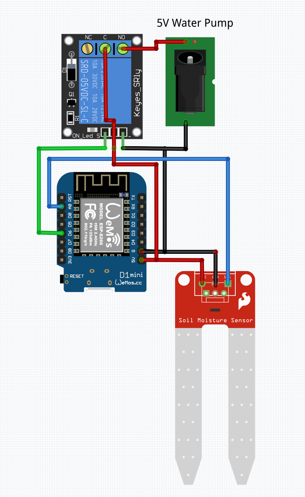
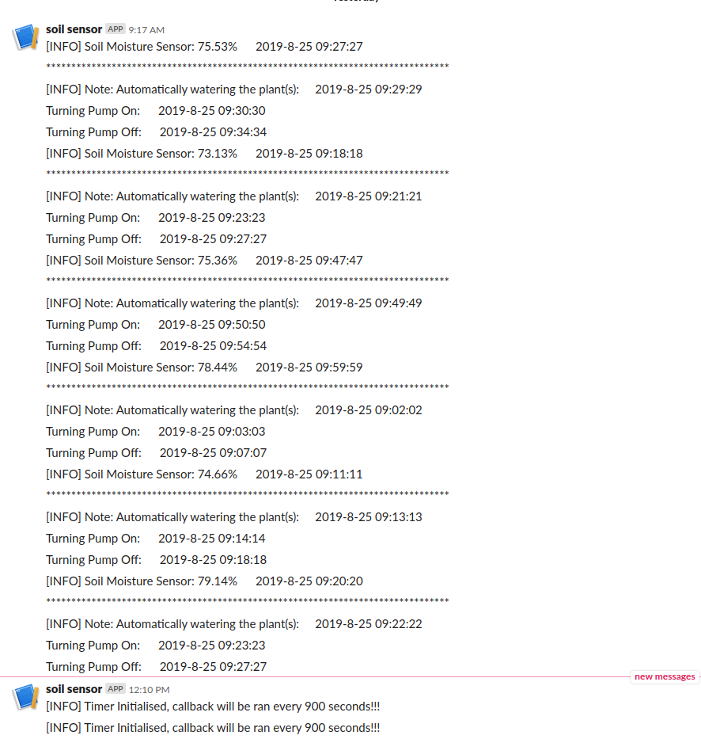
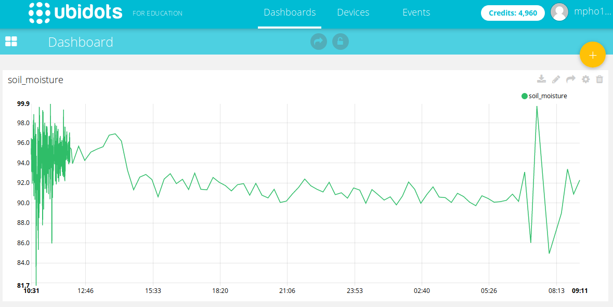

# uPython-moisture-sensor

**uPython based soil moisture sensor running on an esp8266**

## Story

Indoor plants can add new life to a space, increase oxygen in a space which can lead to more productivity and are an inspiration to all, but because of the work that is often required they are replaced with fake plastic plants which are not only unnatural and get thrown in landfills at some point of their life, but they do not offer as many of the benefits that real plants do. Plants are often viewed by younger generation similar to getting a pet because of the responsibilities that come with them, and although plants may make the best roomies they are often forgotten. This is a simple [uPython](http://www.micropython.org/) project for a soil moisture sensor connected to a [Wemos D1 esp8266](https://www.wemos.cc/) board that will send a [Slack](slack.com) message to a specific channel every hour if the flower needs watering. This will save the lives of plants and allow me to focus on other boring stuffs.

## Circuit Diagram

## Calibrating the Soil Moisture Sensor

Calibrating the sensor has two parts, the goal is to make sure sensor functions properly:
*   Connect up the soil moisture sensor and dip it in a bowl of water and take the reading.
*   Wipe the sensor, and place it on dry surface and take the reading

These readings should be entered in [config.json](config.json) file.

## Setup NodeMCU & Tools

Read the [docs](https://docs.micropython.org/en/latest/esp8266/esp8266/tutorial/intro.html)

TL;DR
*   Clone the repo and,
*   Plug in the device to your computer

    **NOTE:** The installation assumes that the port name of device is `/dev/ttyUSB0` else, modify `Makefile` with port name [Hint:`$ ls /dev/tty.*`].
*   Run `make bootstrap`

    **NOTE:** This will install `esptool` and `mpfshell` for communicating with ESP chips and for serial connection with MicroPython boards, Eraze and flash the chip with firmware `esp8266-20190125-v1.10.bin` as well as upload the required files to the ESP.

## Setup Slack

I have made a post on how to create a [Slack](slack.com) API for posting data, Find it [here](http://bit.ly/2K46XP8)
The config goes [here.](config.json)

## Setup Ubidots

Who doesn't love graphs, added [Ubidots](https://ubidots.com/) support for Viz

## Oh, Thanks!

By the way... thank you! And if you'd like to [say thanks](https://saythanks.io/to/mmphego)... :)

✨🍰✨

## Contributing/Feedback

Feel free to fork it or send me PR to improve it.
